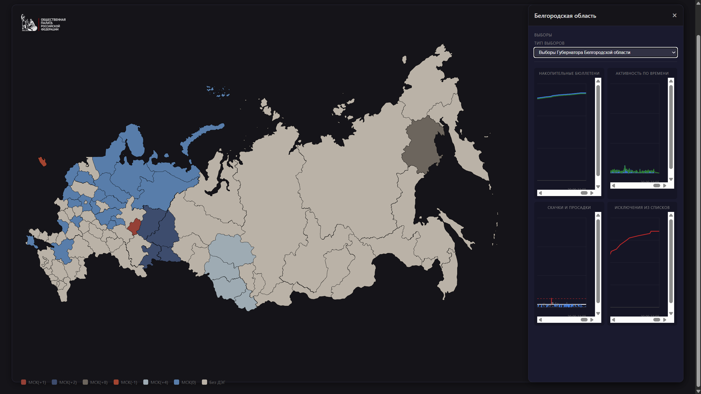

# Интерактивная карта ДЭГ 2026 — выборная статистика по регионам России

Полноценное одностраничное приложение с интерактивной SVG-картой России, на которой отображается статистика федерального дистанционного электронного голосования (ДЭГ) по 32 регионам. При наведении на регион показывается флаг, герб, явка и культурная справка; по клику открывается боковая панель с четырьмя SVG-графиками по каждому округу и типу выборов.



## Возможности

- 🗺️ **Интерактивная карта РФ** — зум (колесо мыши), панорамирование (перетаскивание), двойной клик для сброса масштаба, поддержка тач-жестов.
- 📍 **Тултип по наведению** — флаг, герб, название и тип региона, бюллетени/голоса/избиратели, **исключённые из списков**, явка, народы, языки, ссылки на культурные объекты и галерея фотографий.
- 📊 **Боковая панель по клику** — выбор типа выборов в регионе + 4 графика:
  1. **Накопительные бюллетени** — линии бюллетеней и голосов во времени;
  2. **Активность по времени** — гистограмма выдачи бюллетеней за интервал + линия голосов;
  3. **Скачки и просадки** — отклонение от обычного темпа (z-score) с порогами `+2×` / `−0,7×`;
  4. **Исключения из списков** — накопительное число отказов/удалений избирателей (события `remove`).
- 🔍 **Интерактивные графики** — зум по времени, панорамирование, растяжение, ховер-тултипы с деталями.
- 🏳️ **Флаги и гербы** всех 89 субъектов РФ, **705 ссылок** на музеи/театры/библиотеки, **~560 фото** в галереях.
- 📱 **Адаптивный дизайн**.

## Структура репозитория

```
.
├── setup.py                 # Генератор данных: ZIP → JSON-файлы в src/
├── datasets/
│   └── edg2026.zip          # Исходные сырые данные (неизменяемые)
├── misc/
│   └── img1.png             # Скриншот приложения
├── src/                     # Само приложение (фронтенд)
│   ├── index.html           # Главная страница (карта + сайдбар)
│   ├── app.js               # Логика: карта, тултипы, графики, зум/пан
│   ├── map-data.js          # Конфигурация регионов (коды RU-XX, цвета, типы)
│   ├── map.html             # Исходная SVG-карта + культурные данные
│   ├── preprocess.py        # Альтернативный препроцессор (region-timeseries.json)
│   ├── feddeg_dashboard.json   # Временные ряды и статистика (генерируется)
│   ├── election-data.json      # Сводка по регионам (генерируется)
│   ├── region-details.json     # Культурная справка (генерируется)
│   └── Интерактивная карта Российской Федерации_files/   # PNG: флаги, гербы, фото
└── site/                    # Альтернативный статический дашборд (списки/таблицы)
    ├── index.html
    ├── app.js
    ├── styles.css
    ├── russia-map.svg
    └── data/feddeg_dashboard.json
```

## Требования

- **Python 3.9+** с библиотеками `pandas` и `numpy` (для `setup.py`):
  ```bash
  pip install pandas numpy
  ```
- **Современный браузер** (Chrome, Firefox, Edge, Safari).
- **Любой статический веб-сервер** (Python `http.server`, nginx, и т.п.).

## Быстрый старт

### 1. Соберите данные

Из корня репозитория:

```bash
python setup.py
```

Скрипт читает `datasets/edg2026.zip` и `src/map.html` и генерирует три файла в `src/`:

| Файл | Что содержит |
|------|--------------|
| `feddeg_dashboard.json` | Временные ряды (шаг 5 мин) и статистика по регионам/округам, включая число исключённых избирателей |
| `election-data.json` | Сводка по региону: бюллетени, голоса, избиратели, явка, исключено |
| `region-details.json` | Культурная справка: народы, языки, ссылки, галерея, флаг, герб |

Пример вывода:

```
Источник: datasets\edg2026.zip
Итого: 32 регионов, 1719 округов, 12 088 374 голосов
Списки: 13 419 741 избирателей, 122 442 исключено
Регионы на карте: 89
Сводка по регионам: 32
```

> **Параметры:** `python setup.py --archive datasets/edg2026.zip --out-dir src` — можно указать другой архив или каталог.

### 2. Запустите веб-сервер

```bash
python -m http.server 8080 --bind 127.0.0.1 --directory src
```

### 3. Откройте в браузере

```
http://127.0.0.1:8080/
```

> **Важно:** открывайте через HTTP-сервер, а не как `file://…`, иначе браузер заблокирует загрузку JSON и SVG из-за CORS.

## Использование

1. **Наведите курсор на регион** — появится тултип с флагом, гербом, статистикой (бюллетени, голоса, избиратели, исключено, явка), народами, языками, культурными ссылками и галереей.
2. **Кликните по региону** — откроется боковая панель с названием региона.
3. **Выберите тип выборов** в выпадающем списке — обновятся все четыре графика.
4. **Взаимодействуйте с графиками**:
   - колесо мыши — зум по горизонтали (время);
   - `Ctrl`/`Cmd` + колесо — зум по вертикали (значения);
   - перетаскивание — панорамирование;
   - наведение — детальный тултип в точке.

## Формат данных

### Входные CSV (в `datasets/edg2026.zip`)

| Файл | Поля |
|------|------|
| `elections.csv` | `contract_id`, `region`, `election`, `district` |
| `ballots.csv` | `contract_id`, `uik`, `timestamp` |
| `votes.csv` | `contract_id`, `timestamp` |
| `voter_list_events.csv` | `contract_id`, `uik`, `timestamp`, `count`, `type` |

События списков избирателей — «длинный» формат: `type` принимает значения `initial` (исходный список), `add` (добавлено) и `remove` (исключено/отказ). Именно из `remove` считается статистика отказов (удалений из списков).

### `feddeg_dashboard.json` (для графиков)

```json
{
  "bucketMinutes": 5,
  "timeline": { "start": "2026-09-18 00:00", "end": "2026-09-20 21:05" },
  "totals": { "voters": 13419741, "removed_voters": 122442, "ballots": 12202035, "votes": 12088374 },
  "regions": [
    {
      "id": "moscow-oblast",
      "name": "Московская область",
      "voters": 2979143, "removed_voters": 19703,
      "ballots": 2728649, "votes": 2702361,
      "districtIds": ["d322", "..."],
      "series": [[0, 0, 0], [5, 598, 34], "..."],
      "removedSeries": [[0, 4], [25, 8], "..."]
    }
  ],
  "districts": [
    { "id": "d322", "name": "...", "regionId": "moscow-oblast", "elections": ["..."], "series": [...], "removedSeries": [...] }
  ]
}
```

- `series` — массив `[offset_минут, накопленные_бюллетени, накопленные_голоса]`;
- `removedSeries` — массив `[offset_минут, накопленные_исключения]`.

### Идентификаторы регионов

Карта (`map.html`) размечает регионы атрибутами `data-code="RU-XX"`. Маппинг `RU-XX → slug-id` (например `RU-SVE → sverdlovsk`) задан в `src/map-data.js` (`regionCodeMap`), а `slug-id → русское название` — в `src/map-data.js` (`regionNames`) и в `setup.py` (`REGION_NAME_TO_ID`).

## Как это работает

```
datasets/edg2026.zip (CSV)
        │
        ▼
   setup.py (pandas + csv)
        │  ├─ парсинг elections/ballots/votes/voter_list_events
        │  ├─ агрегация по регионам и округам (5-минутные бакеты)
        │  ├─ подсчёт отказов (remove) и временных рядов исключений
        │  └─ извлечение культурных данных из map.html
        ▼
src/feddeg_dashboard.json + election-data.json + region-details.json
        │
        ▼
src/index.html + app.js + map-data.js + map.html  →  интерактивная карта
```

## Детали реализации

- **Карта** — `map.html` содержит единственный `<svg viewBox="0 0 808.9 458.9">` с 89 регионами (`path[data-code]` и `g[data-code]` для многоостровных субъектов). `loadSVGMap()` в `app.js` извлекает SVG и накладывает цвета по явке, зум и панорамирование через CSS `transform`.
- **Графики** — кастомные SVG-графики (`mountChart`, `mountActivityChart`, `mountAnomalyChart`, `mountRemovedChart`), без внешних библиотек.
- **Аномалии** — отклонение выдачи бюллетеней от медианного 5-минутного темпа; пороги `+2×` (всплеск) и `−0,7×` (просадка).

## Решение проблем

- **Графики/данные не загружаются** — откройте консоль браузера (F12); убедитесь, что JSON-файлы созданы в `src/` (`python setup.py`) и сайт открыт через `http://…`, а не `file://`.
- **Карта не отображается** — проверьте, что `src/map.html` на месте и содержит SVG с `data-code="RU-XX"`.
- **Ошибка кодировки на Windows**:
  ```powershell
  $env:PYTHONIOENCODING="utf-8"; python setup.py
  ```

## Лицензия

MIT License — свободное использование, модификация и распространение.
